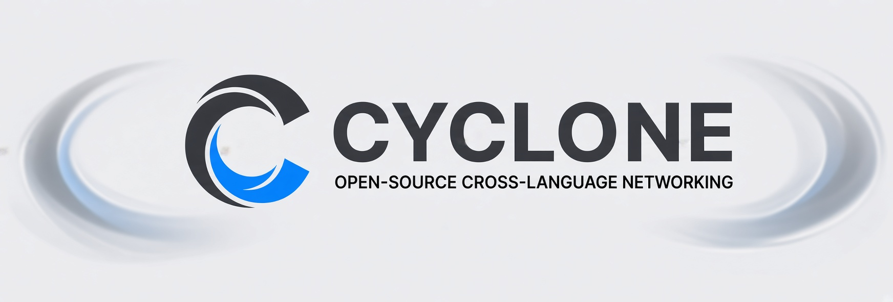

  

**Open-source cross-language networking stack.**

Build interoperable clients and servers across:
C# · Rust · Go · GDScript

### Projects

- [Cyclone Protocol](https://cyclone-protocol.github.io) — Protocol specification
- `cyclonec` — Code generator
- `cyclone-unity` — Unity SDK
- `cyclone-godot` — Godot SDK
- `cyclone-rust` — Rust SDK
- `cyclone-go` — Go SDK